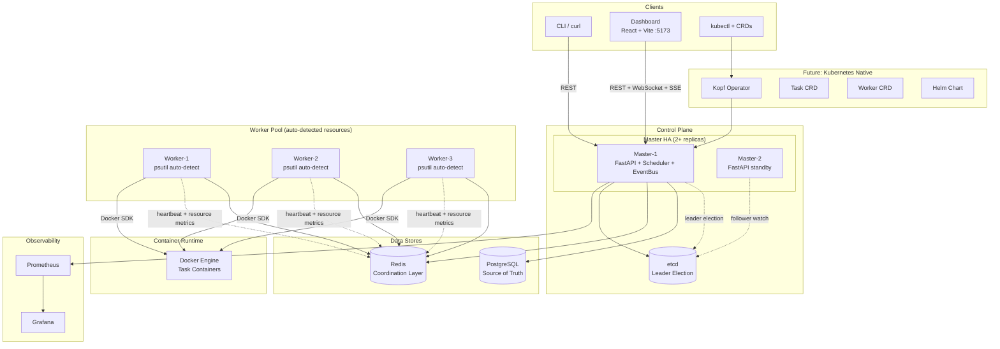
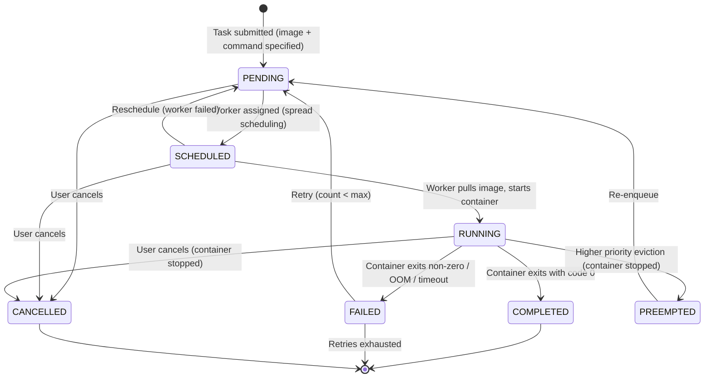
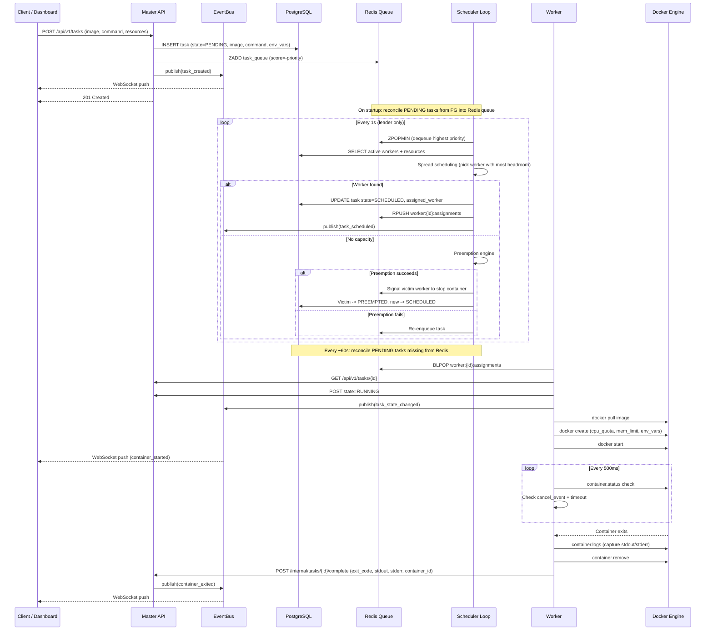
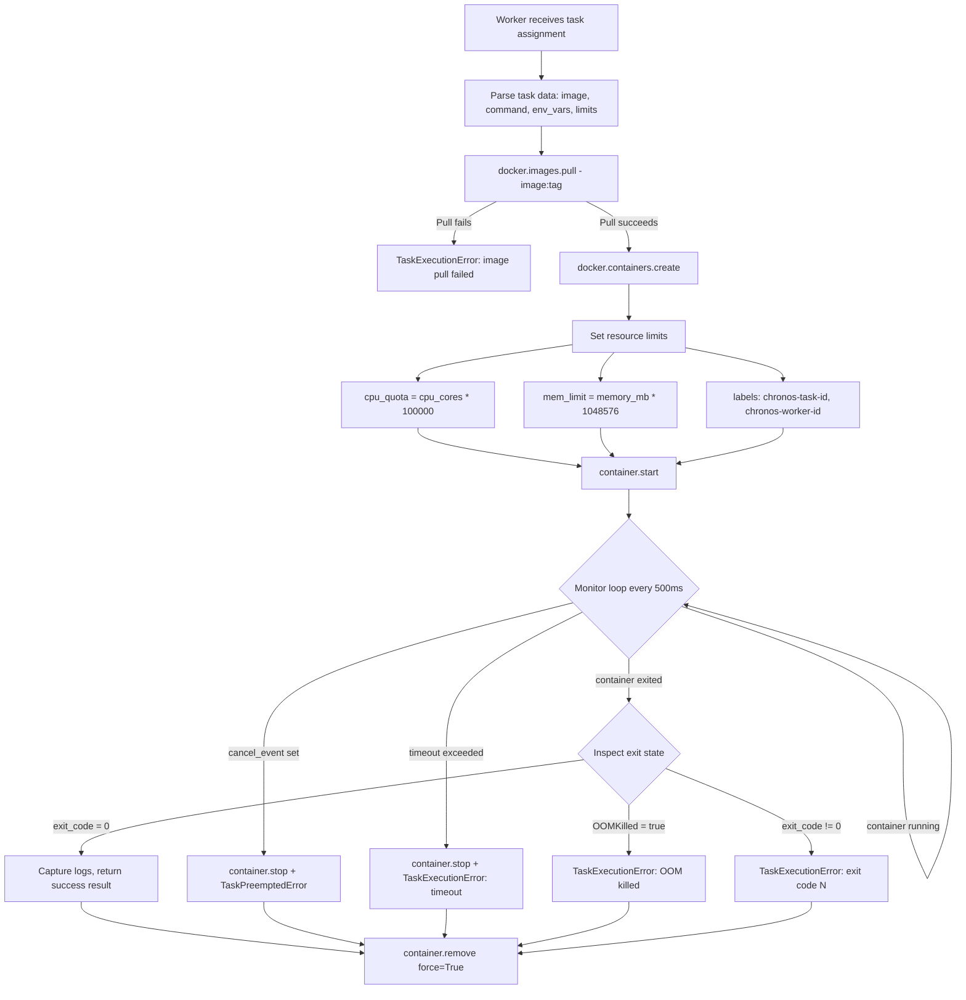
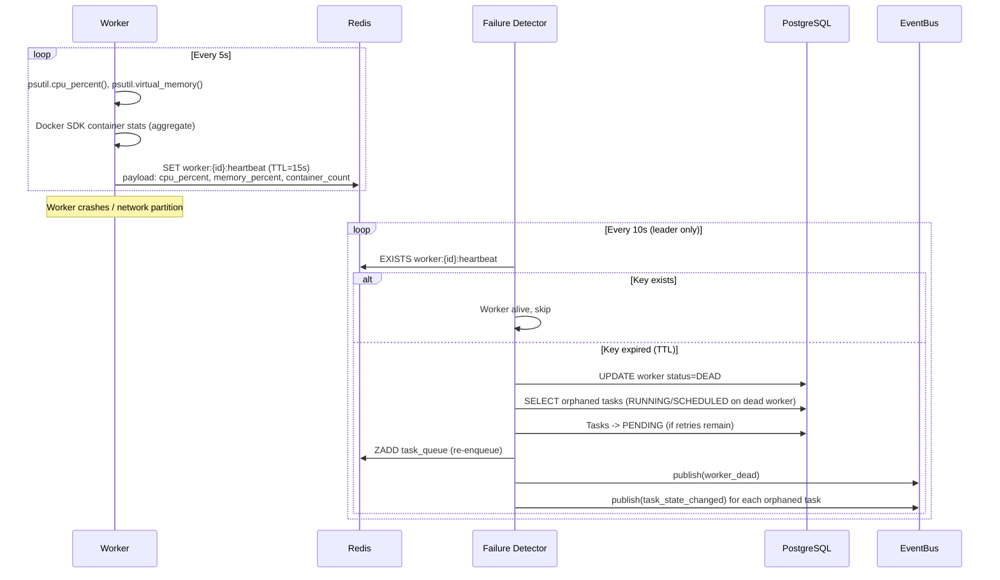
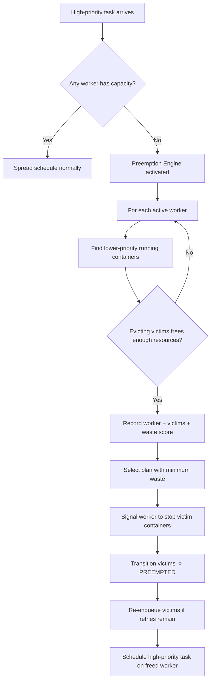
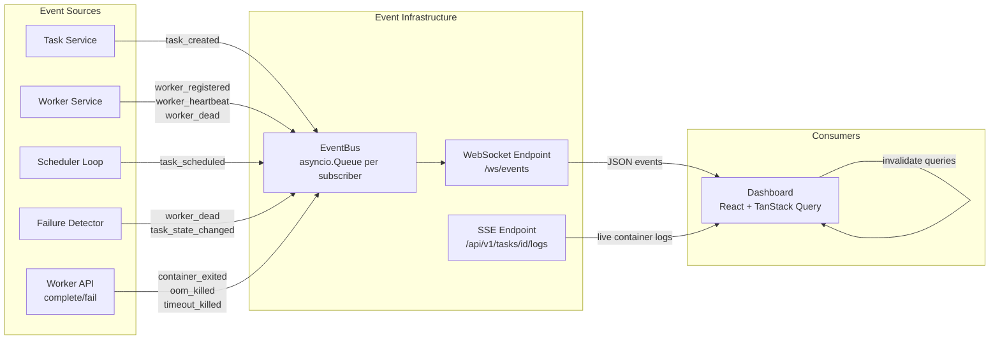
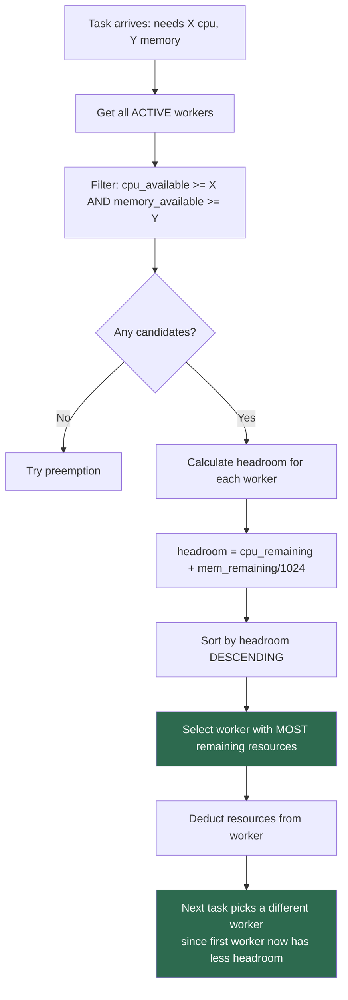
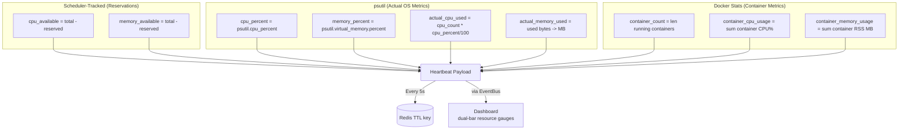

# Chronos-K8s-Scheduler Architecture

## System Architecture

## Task Lifecycle

## Scheduling Flow

## Docker Container Execution Flow

## Failure Detection Flow

## Preemption Flow

## Real-Time Event Flow

## Spread Scheduling Algorithm

> **Why spread over best-fit?** When workers run on the same host (common in dev/test with Docker Compose), best-fit always picks the same worker because all workers report identical resources. Spread scheduling naturally round-robins tasks across all available nodes by always choosing the worker with the most remaining capacity.

## Worker Resource Reporting

## Redis Data Layout

| Key Pattern | Type | Purpose |
|---|---|---|
| `chronos:task_queue` | Sorted Set | Priority queue (score = -priority) |
| `chronos:worker:{id}:heartbeat` | String + TTL | Heartbeat with 15s expiry (includes resource metrics) |
| `chronos:worker:{id}:assignments` | List | Per-worker task assignment queue |
| `chronos:worker:{id}:preempt` | List | Preemption signal queue |
| `chronos:worker:{id}:active_tasks` | Set | Currently running task IDs |
| `chronos:lock:scheduler` | Lock | Exclusive scheduler tick |
| `chronos:lock:preemption` | Lock | Exclusive preemption operation |

## Docker Container Labels

Each task container is labeled for identification and orphan cleanup:

| Label | Value | Purpose |
|---|---|---|
| `chronos.managed` | `true` | Identifies Chronos-managed containers |
| `chronos.task_id` | UUID | Links container to task |
| `chronos.worker_id` | string | Links container to worker |

On startup, workers query `chronos.managed=true` + `chronos.worker_id={self}` to find and remove orphaned containers from previous runs.
