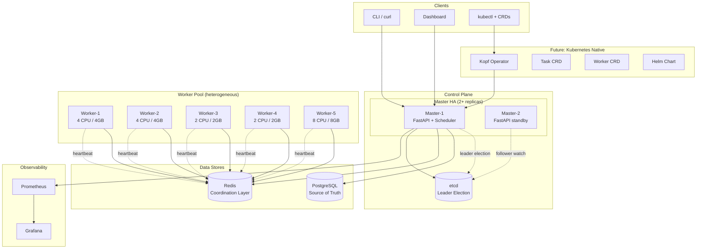
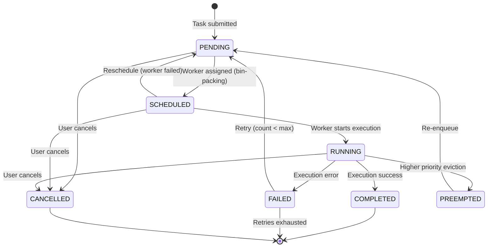
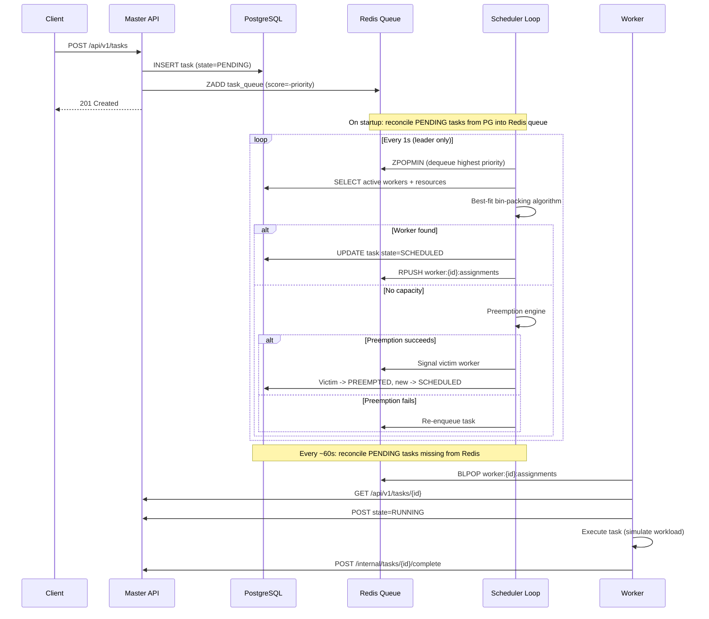
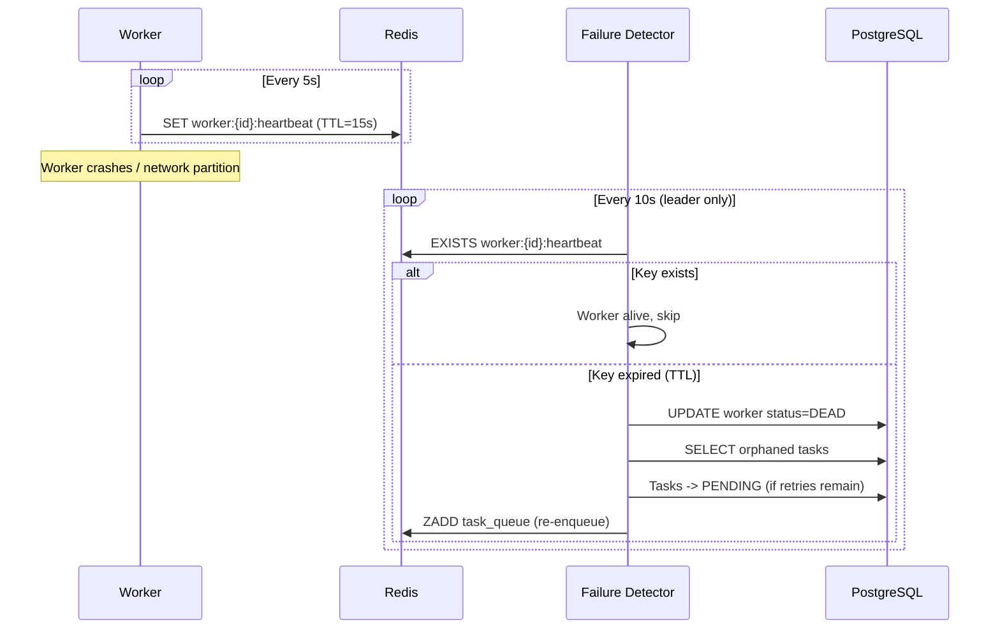
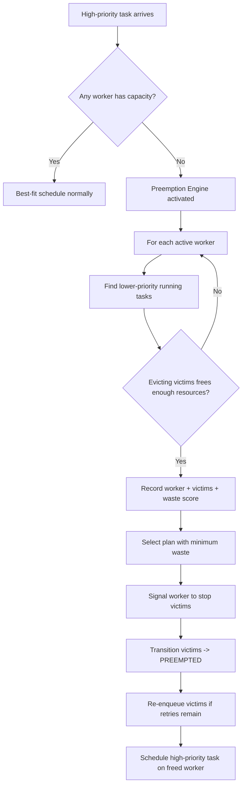

# Chronos-K8s-Scheduler Architecture

## System Architecture

## Task Lifecycle

## Scheduling Flow

## Failure Detection Flow

## Preemption Flow

## Redis Data Layout

| Key Pattern | Type | Purpose |
|---|---|---|
| `chronos:task_queue` | Sorted Set | Priority queue (score = -priority) |
| `chronos:worker:{id}:heartbeat` | String + TTL | Heartbeat with 15s expiry |
| `chronos:worker:{id}:assignments` | List | Per-worker task assignment queue |
| `chronos:worker:{id}:preempt` | List | Preemption signal queue |
| `chronos:worker:{id}:active_tasks` | Set | Currently running task IDs |
| `chronos:lock:scheduler` | Lock | Exclusive scheduler tick |
| `chronos:lock:preemption` | Lock | Exclusive preemption operation |
